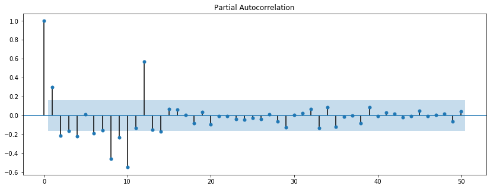
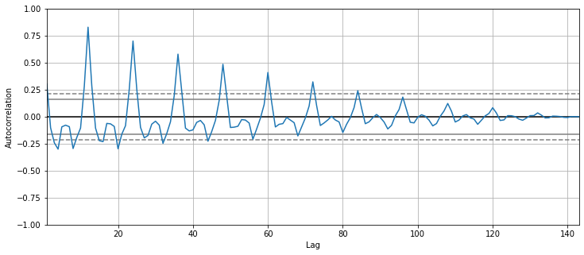

# Correlation and Autocorrelation in Time Series - Lab

## Introduction

In this lab, You'll practice your knowledge on correlation, autocorrelation and the ACF and PACF.

## Objectives

You will be able to:
- Understand correlation in Time Series
- Plot and discuss the autocorrelation function (ACF) for a time-series 
- Plot and discuss the partial autocorrelation function (PACF) for a time-series 
- Interpret ACF and PACF and Identify use cases both functions

## The Exchange Rate Data

We'll be looking at the exchange rates dataset again. First, import the necessary libraries for time series and plotting. Then import the data (in `exch_rates.csv`) and make sure it's set in the correct time series format with the `datetime` as the index.


```python
# your code here
```


```python
# __SOLUTION__ 
import pandas as pd
from pandas import Series
import numpy as np
import matplotlib.pylab as plt
%matplotlib inline
```


```python
# your code here
```


```python
# __SOLUTION__ 
xr = pd.read_csv("exch_rates.csv")

xr['Frequency'] = pd.to_datetime(xr['Frequency'])
xr.set_index('Frequency', inplace=True)
```

Plot the three exchange rates in one plot


```python
# your code here
```


```python
# __SOLUTION__ 
xr.plot(figsize=(18,6))
plt.xlabel('Year', fontsize=14);
```


You can see that the EUR/USD and AUD/USD exchange rate are somewhere between rougly 0.5 and 2 between 2000 and 2018, where the Danish Krone is somewhere between roughly 4.5 and 9. Now let's look at the correlations between these time series.


```python
# your code here
```


```python
# __SOLUTION__ 
xr.corr()
```


<div>
<style scoped>
    .dataframe tbody tr th:only-of-type {
        vertical-align: middle;
    }

    .dataframe tbody tr th {
        vertical-align: top;
    }

    .dataframe thead th {
        text-align: right;
    }
</style>
<table border="1" class="dataframe">
  <thead>
    <tr style="text-align: right;">
      <th></th>
      <th>Euro</th>
      <th>Australian Dollar</th>
      <th>Danish Krone</th>
    </tr>
  </thead>
  <tbody>
    <tr>
      <th>Euro</th>
      <td>1.000000</td>
      <td>0.883181</td>
      <td>0.999952</td>
    </tr>
    <tr>
      <th>Australian Dollar</th>
      <td>0.883181</td>
      <td>1.000000</td>
      <td>0.882513</td>
    </tr>
    <tr>
      <th>Danish Krone</th>
      <td>0.999952</td>
      <td>0.882513</td>
      <td>1.000000</td>
    </tr>
  </tbody>
</table>
</div>


### What is your conclusion here? You might want to use outside resources to understand what's going on.


```python
# __SOLUTION__
# The exchange rates for Euro and the Australian dollar are highly correlated, 
# but there are differences. The Euro and the Danish Krone, however, is perfectly correlated. 
# If you do further research you'll notice that the Danish Krone is pegged to the Euro, 
# which means that they are basically designed to perfectly correlate together! 
# The fact that the value is just very, very close to 1 is due to rounding errors.
```

Next, look at the plots of the differenced series. Use subplots to plot them rather than creating just one plot.


```python
# your code here
```


```python
# __SOLUTION__ 
xr_diff = xr.diff(periods=1)
```


```python
# your code here
```


```python
# __SOLUTION__ 
xr_diff.plot(figsize = (13,8), subplots=True, legend=True);
```


```python
# your code here
```


```python
# __SOLUTION__ 
xr_diff.corr()
```


<div>
<style scoped>
    .dataframe tbody tr th:only-of-type {
        vertical-align: middle;
    }

    .dataframe tbody tr th {
        vertical-align: top;
    }

    .dataframe thead th {
        text-align: right;
    }
</style>
<table border="1" class="dataframe">
  <thead>
    <tr style="text-align: right;">
      <th></th>
      <th>Euro</th>
      <th>Australian Dollar</th>
      <th>Danish Krone</th>
    </tr>
  </thead>
  <tbody>
    <tr>
      <th>Euro</th>
      <td>1.000000</td>
      <td>0.545369</td>
      <td>0.999667</td>
    </tr>
    <tr>
      <th>Australian Dollar</th>
      <td>0.545369</td>
      <td>1.000000</td>
      <td>0.545133</td>
    </tr>
    <tr>
      <th>Danish Krone</th>
      <td>0.999667</td>
      <td>0.545133</td>
      <td>1.000000</td>
    </tr>
  </tbody>
</table>
</div>


### Explain what's going on


```python
# __SOLUTION__
# Differencing the series here led to a decrease 
# in correlation between the EUR/USD and AUD/USD series. 
# If you think a little further, this makes sense: in the lecture before, 
# the high correlation was a result of seasonality. 
# Differencing led to an increase in correlation between series, 
# here the series are moving in the (more or less) same direction 
# on a day-to-day basis and seasonality is not present, hence this result.
```

Next, let's look at the "lag 1 autocorrelation" for the EUR/USD exchange rate. Create a "lag 1 autocorrelation" series, plot the result, and look at the correlation coefficient.


```python
# your code here
```


```python
# __SOLUTION__ 
eur = xr[['Euro']]
```


```python
# your code here
```


```python
# __SOLUTION__ 
eur_shift_1 = eur.shift(periods=1)
eur_shift_1.head()

lag_1= pd.concat([eur_shift_1, eur], axis=1)
lag_1.plot(figsize=(18,6), alpha=0.5);
```


```python
# your code here
```


```python
# __SOLUTION__ 
lag_1.corr()
```


<div>
<style scoped>
    .dataframe tbody tr th:only-of-type {
        vertical-align: middle;
    }

    .dataframe tbody tr th {
        vertical-align: top;
    }

    .dataframe thead th {
        text-align: right;
    }
</style>
<table border="1" class="dataframe">
  <thead>
    <tr style="text-align: right;">
      <th></th>
      <th>Euro</th>
      <th>Euro</th>
    </tr>
  </thead>
  <tbody>
    <tr>
      <th>Euro</th>
      <td>1.000000</td>
      <td>0.999146</td>
    </tr>
    <tr>
      <th>Euro</th>
      <td>0.999146</td>
      <td>1.000000</td>
    </tr>
  </tbody>
</table>
</div>


Repeat this, but for a "lag 50 autocorrelation"


```python
# your code here
```


```python
# __SOLUTION__ 
eur_shift_50 = eur.shift(periods=50)
eur_shift_50.head()

lag_50= pd.concat([eur_shift_50, eur], axis=1)
lag_50.plot(figsize=(18,6), alpha=0.8);
```


```python
# your code here
```


```python
# __SOLUTION__ 
lag_50.corr()
```


<div>
<style scoped>
    .dataframe tbody tr th:only-of-type {
        vertical-align: middle;
    }

    .dataframe tbody tr th {
        vertical-align: top;
    }

    .dataframe thead th {
        text-align: right;
    }
</style>
<table border="1" class="dataframe">
  <thead>
    <tr style="text-align: right;">
      <th></th>
      <th>Euro</th>
      <th>Euro</th>
    </tr>
  </thead>
  <tbody>
    <tr>
      <th>Euro</th>
      <td>1.000000</td>
      <td>0.968321</td>
    </tr>
    <tr>
      <th>Euro</th>
      <td>0.968321</td>
      <td>1.000000</td>
    </tr>
  </tbody>
</table>
</div>


### What's your conclusion here?


```python
# __SOLUTION__
# Autocorrelation is very high in these time series, even up to a lag as big as 50! 
# This is no big surprise though: remember that these are random walk series, 
# which are highly recursive, as each value depends heavily on the previous one!
```

Knowing this, let's plot the ACF now.


```python
# your code here
```


```python
# __SOLUTION__ 
plt.figure(figsize=(12,5))
pd.plotting.autocorrelation_plot(eur.dropna());
```





The series is heavily autocorrelated at first, and then there is a decay. This is a typical result for a series that is a random walk, generally you'll see heavy autocorrelations first, slowly tailing off until there is no autocorrelation anymore.

Next, let's look at the Partial Autocorrelation Function.


```python
# your code here
```


```python
# __SOLUTION__ 
from statsmodels.graphics.tsaplots import plot_pacf
from matplotlib.pylab import rcParams

rcParams['figure.figsize'] = 14, 5

plot_pacf(eur.dropna(), lags = 100, method='ywm');
```


This is interesting! Remember that *Partial Autocorrelation Function* gives the partial correlation of a time series with its own lagged values, controlling for the values of the time series at all shorter lags. When controlling for 1 period lags, the PACF is only very high for one-period lags, and basically 0 for shorter lags. This is again a typical result for Random Walk series!

## The Airpassenger Data

Look at ACF and PACF for the airpassenger data and describe the result `passengers.csv`. Do this both for the differenced and regular series.


```python
# your code here
```


```python
# __SOLUTION__ 
air= pd.read_csv('passengers.csv')
air.Month = pd.to_datetime(air.Month)
air.set_index('Month', inplace = True)
```


```python
# your code here
```


```python
# __SOLUTION__ 
air.plot()
```


    <matplotlib.axes._subplots.AxesSubplot at 0x11aea9f28>


```python
# your code here
```


```python
# __SOLUTION__ 
plt.figure(figsize=(12,5))
pd.plotting.autocorrelation_plot(air);
```


```python
# your code here
```


```python
# __SOLUTION__ 
from statsmodels.graphics.tsaplots import plot_pacf
from matplotlib.pylab import rcParams
rcParams['figure.figsize'] = 14, 5
plot_pacf(air.dropna(), lags = 100, method='ywm');
```


```python
# your code here
```


```python
# __SOLUTION__ 
air_diff = air.diff(periods=1)
```


```python
# your code here
```


```python
# __SOLUTION__ 
plt.figure(figsize=(12,5))
pd.plotting.autocorrelation_plot(air_diff.dropna());
```


```python
# your code here
```


```python
# __SOLUTION__ 
from statsmodels.graphics.tsaplots import plot_pacf
from matplotlib.pylab import rcParams

rcParams['figure.figsize'] = 14, 5

plot_pacf(air_diff.dropna(), lags = 100, method='ywm');
```





### Your conclusion here


```python
# __SOLUTION__
# The result reminds us a lot of the google trends data. 
# The seasonality is much more clear in the differenced time series. 
# The PACF has just one very strong correlation, right at 12 months.
```

## The NYSE data

Look at correlation and autocorrelation functions for the NYSE data ("NYSE_monthly.csv")


```python
# your code here
```


```python
# __SOLUTION__ 
data = pd.read_csv("NYSE_monthly.csv")
col_name= 'Month'
data[col_name] = pd.to_datetime(data[col_name])
data.set_index(col_name, inplace=True)
data.head()
```


<div>
<style scoped>
    .dataframe tbody tr th:only-of-type {
        vertical-align: middle;
    }

    .dataframe tbody tr th {
        vertical-align: top;
    }

    .dataframe thead th {
        text-align: right;
    }
</style>
<table border="1" class="dataframe">
  <thead>
    <tr style="text-align: right;">
      <th></th>
      <th>monthly_return</th>
    </tr>
    <tr>
      <th>Month</th>
      <th></th>
    </tr>
  </thead>
  <tbody>
    <tr>
      <th>1961-01-01</th>
      <td>0.082</td>
    </tr>
    <tr>
      <th>1961-02-01</th>
      <td>0.059</td>
    </tr>
    <tr>
      <th>1961-03-01</th>
      <td>0.050</td>
    </tr>
    <tr>
      <th>1961-04-01</th>
      <td>0.008</td>
    </tr>
    <tr>
      <th>1961-05-01</th>
      <td>0.042</td>
    </tr>
  </tbody>
</table>
</div>


```python
# your code here
```


```python
# __SOLUTION__ 
plt.figure(figsize=(12,5))
pd.plotting.autocorrelation_plot(data.dropna());
```


```python
# your code here
```


```python
# __SOLUTION__ 
from statsmodels.graphics.tsaplots import plot_pacf
from matplotlib.pylab import rcParams

rcParams['figure.figsize'] = 14, 5

plot_pacf(data, lags = 100, method='ywm');
```


## Your conclusion here


```python
# __SOLUTION__
# Autocorrelations and partial autocorrelations are virtually 0 for any lag. 
# This is no surprise! The NYSE series was a white noise series, meaning there is no trend or no seasonality! 
# This is, again, a typical result for these kind of series.

```


## Summary

Great, you've now been introduced to correlation, the ACF and PACF. Let's move into more serious modeling with autoregressive and moving average models!
